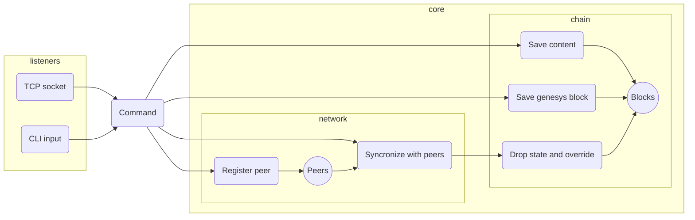

# Minchain architecture

## Network protocol

The "protocol" is a simple JSON-over-TCP, a packet ends with `\n`

There is a "listener" abstraction which enables that communication between the app and the command line interface or TCP are handled exactly the same way. 

The only difference is the output formatting: for the CLI, we indicate the result with colors and emojis, for TCP we compress the result into one line so it is considered as one packet.

This would be a huge security risk in a real-life situation, but this projects serves only demonstration purposes so its ok. This "security gap" is used by the `sync` command which executes the `print` command on the peers via TCP socket and the deserializes the response.

## Command reference

| Command   | Param           | Description                                          |
|-----------|-----------------|------------------------------------------------------|
|addgen     | -               | Adds genesis block                                   |
|addcontent | the content     | Mines a new block with an arbitrary content          |
|addpeer    | `{host}:{port}` | Adds a new peer which can be used for syncronization |
| print     | -               | Pretty-prints the whole chain in json format         |
| sync      | -               | Triggers synchronization with peers                  |